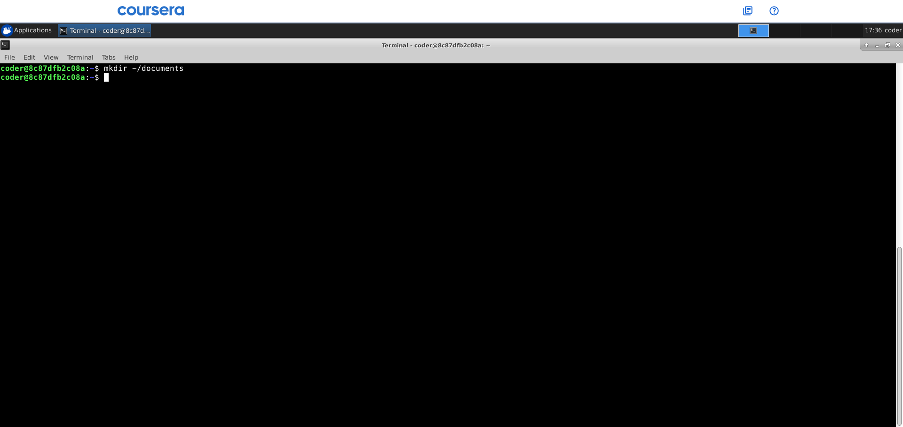
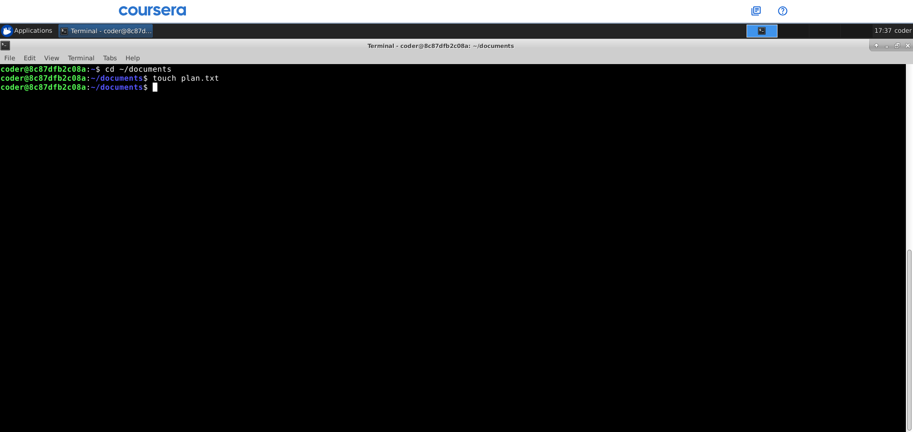
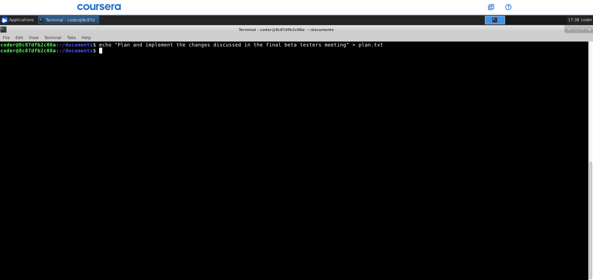
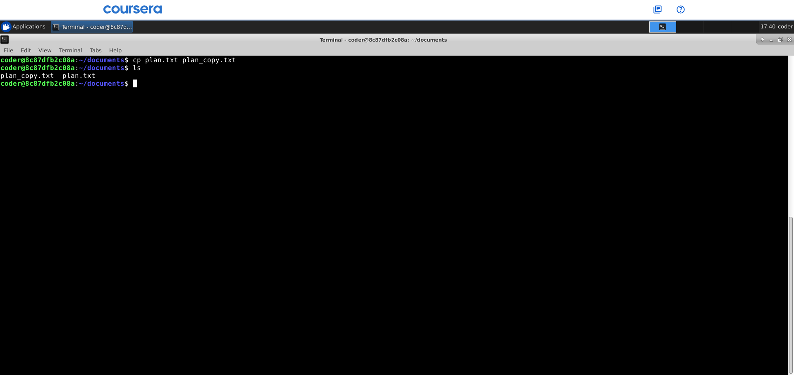
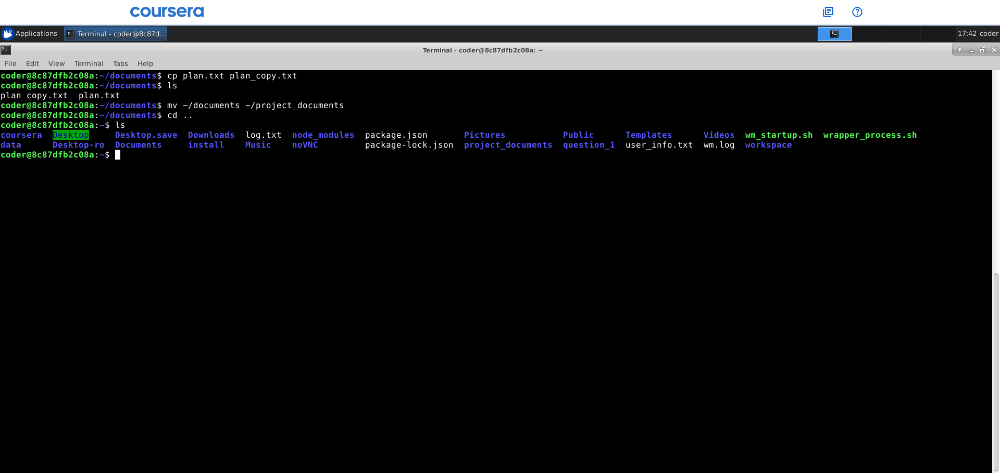
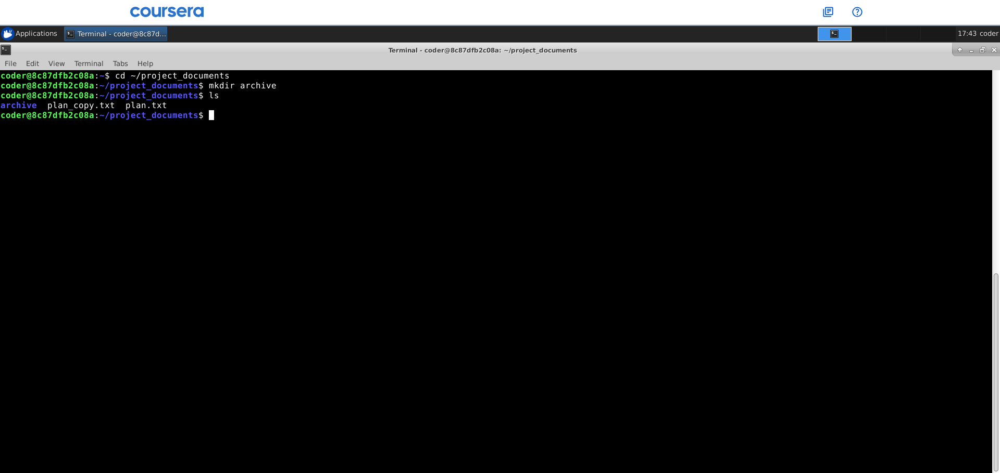
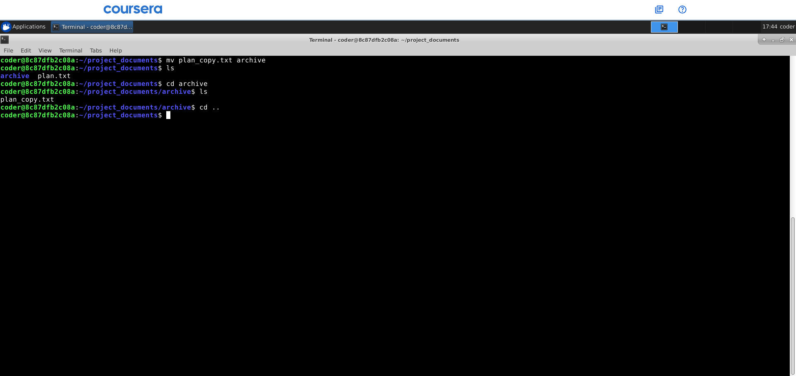
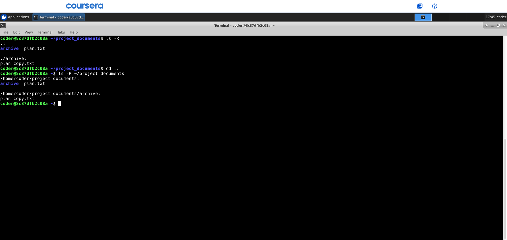
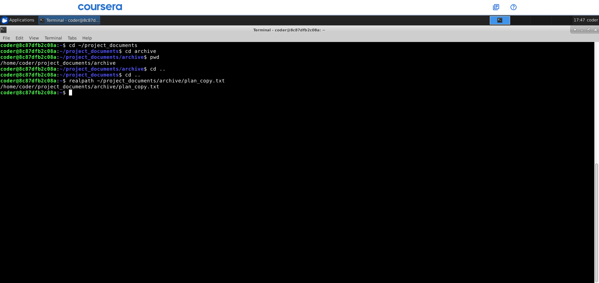

# Command Line Interface and Systems SGA 1 - Question 2: File and Directory Management

---

## Task 1: Project Workspace Setup

### Question
Create a directory named `documents` inside your home directory. This directory will store your project-related files.

### Screenshot


### Command Used
```bash
mkdir ~/documents
```

### Explanation
To create the `documents` directory in my home directory, I used the `mkdir` command. The tilde (`~`) symbol is a shortcut for the home directory. I used the `ls` command to verify that the directory has been created.

---

## Task 2: File Creation

### Question
Navigate into the `documents` directory and create a file named `plan.txt`.

### Screenshot


### Commands Used
```bash
cd ~/documents
touch plan.txt
```

### Explanation
I navigated into the new directory using `cd` (change directory) and then created the `plan.txt` file using the `touch` command.

---

## Task 3: Content Addition

### Question
Write some sample text of your choice into the `plan.txt` file. The content can be a short project note or reminder.

### Screenshot


### Command Used
```bash
echo "Plan and implement changes discussed in the final beta testers meeting" > plan.txt
```

### Explanation
To add text to the file, I used the `echo` command with the `>` redirection symbol, which sends the text into the file.

---

## Task 4: File Metadata Verification

### Question
Display the permissions and ownership details of the `plan.txt` file. Ensure your username appears in the output.

### Screenshot


### Command Used
```bash
ls -l plan.txt
```

### Explanation
To view the permissions, owner, and group details, I used `ls -l` (long format listing). The username in my system, which is `coder`, appears in the output.

---

## Task 5: File Duplication

### Question
Create a copy of `plan.txt` and name it `plan_copy.txt`.

### Screenshot


### Command Used
```bash
cp plan.txt plan_copy.txt
```

### Explanation
I used the `cp` (copy) command to create a duplicate of the `plan.txt` file.

---

## Task 6: Directory Renaming

### Question
Rename the `documents` directory to `project_documents` to reflect the project scope more clearly.

### Screenshot


### Command Used
```bash
mv ~/documents ~/project_documents
```

### Explanation
The `mv` (move) command is used for both moving and renaming files or directories. Therefore, I used the `mv` command with the directory names. I was in the directory that was being renamed, so I went back using `cd ..` and then used the `ls` command to check if the name had been changed. The name was changed successfully. Then I used `cd` with the directory name to go back inside the directory to continue with the remaining tasks.

---

## Task 7: Archival Structure

### Question
Inside the `project_documents` directory, create a subdirectory named `archive`.

### Screenshot


### Command Used
```bash
mkdir archive
```

### Explanation
After navigating into the renamed directory, I used `mkdir` again to create the `archive` subdirectory. Then I used `ls` to verify it had been created. The subdirectory was successfully created.

---

## Task 8: File Organization

### Question
Move `plan_copy.txt` into the `archive` subdirectory.

### Screenshot


### Command Used
```bash
mv plan_copy.txt archive
```

### Explanation
I moved the `plan_copy.txt` file into the `archive` directory using the `mv` command. I then used `cd` to change the directory to `archive`, then used `ls` to check if the file had been successfully transferred. I also went back and checked if the file had been moved from the first directory to the subdirectory. The process was successful.

---

## Task 9: Recursive Listing

### Question
List all files and subdirectories inside `project_documents` recursively so that the complete directory structure is visible.

### Screenshot


### Commands Used
```bash
ls -R
ls -R ~/project_documents
```

### Explanation
To view the complete directory structure, including the contents of the `archive` subdirectory, I used `ls -R` (recursive listing). This command was used when I was already in the `project_documents` directory. If I were in the home directory, I would also have to include the path to that directory.

---

## Task 10: Path Verification

### Question
Display the absolute path of the `plan_copy.txt` file after it has been moved to the `archive` directory.

### Screenshot


### Commands Used
```bash
cd archive
pwd
realpath ~/project_documents/archive/plan_copy.txt
```

### Explanation
I navigated into the `archive` directory and used `pwd` (print working directory) to display the absolute path, which shows the full location starting from the root (`/`).

The `realpath` command displays the absolute path of `plan_copy.txt`. This confirms the file's exact location after being moved.

---
