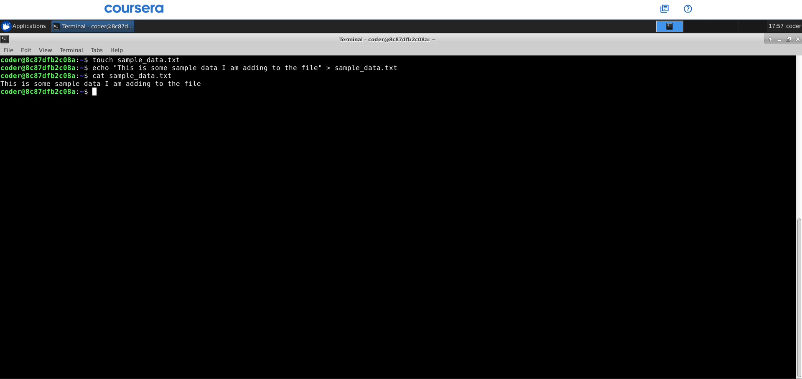
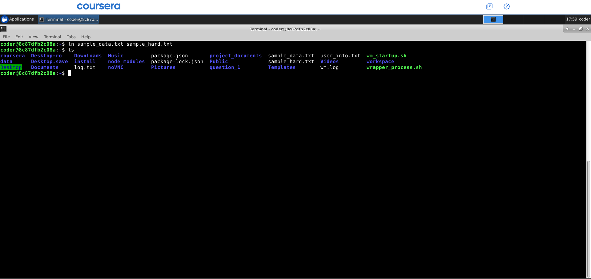
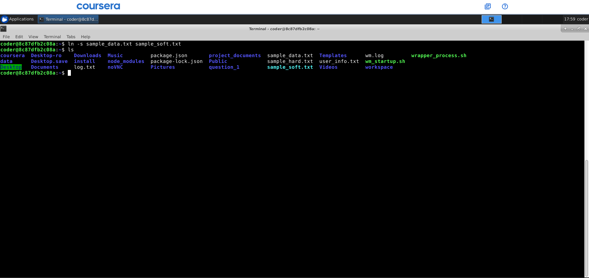
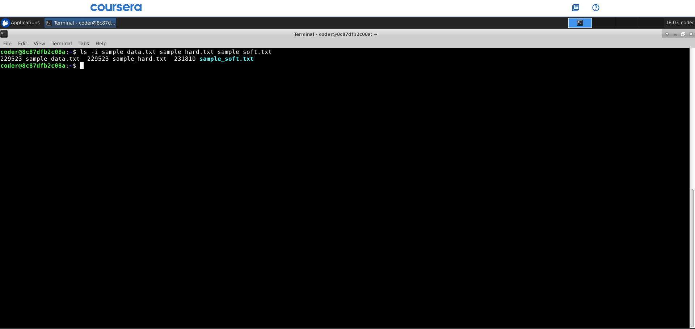
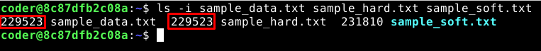
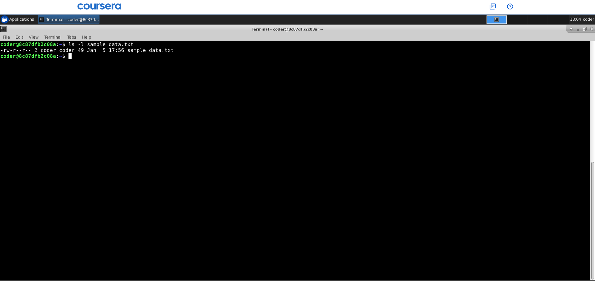
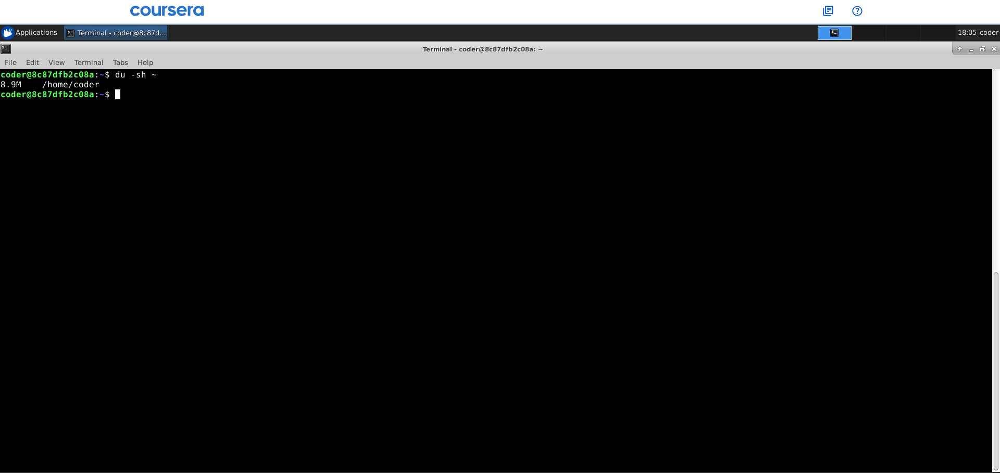
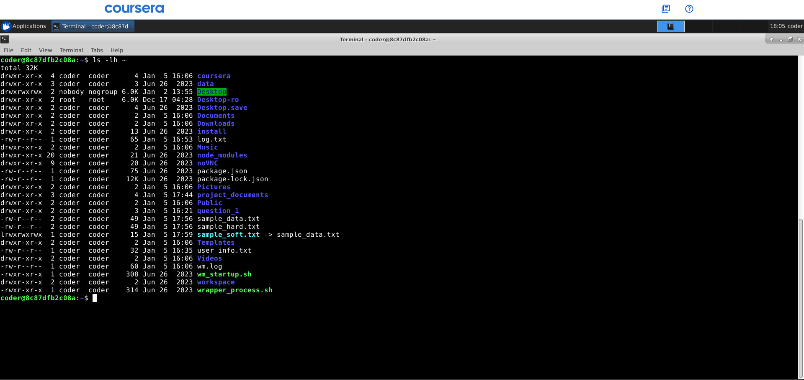
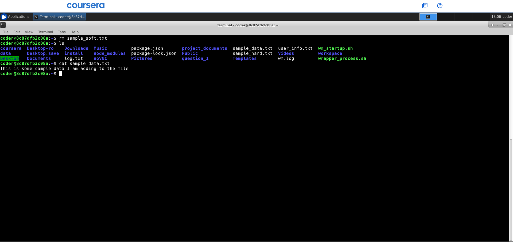

# Command Line Interface and Systems SGA 1 - Question 3: Links and Disk Usage

---

## Overview
You have been asked to understand how Linux manages files using links and disk usage information. As part of your role, you will perform the following operations within your own user space.

---

## Task 1: File Creation

### Question
Create a file named `sample_data.txt` in your home directory and add some sample text to it.

### Screenshot


### Commands Used
```bash
touch sample_data.txt
echo "This is some sample data I am adding to the file" > sample_data.txt
```

### Explanation
To create a new file in the home directory and add text, I used the `touch` command followed by `echo` and output redirection (`>`). I also used the `cat` command to check if the text has been successfully included in the file.

---

## Task 2: Hard Link Creation

### Question
Create a hard link to `sample_data.txt` named `sample_hard.txt`.

### Screenshot


### Command Used
```bash
ln sample_data.txt sample_hard.txt
```

### Explanation
A hard link is a direct reference to the same data (inode) on the disk as the original file. I used the `ln` command to create the hard link.

---

## Task 3: Symbolic Link Creation

### Question
Create a symbolic (soft) link to `sample_data.txt` named `sample_soft.txt`.

### Screenshot


### Command Used
```bash
ln -s sample_data.txt sample_soft.txt
```

### Explanation
A symbolic (soft) link is a special file that acts as a shortcut by containing the path to the target file. To create a soft link, I used the `ln` command with the `-s` option.

---

## Task 4: Inode Verification

### Question
Display the inode numbers of `sample_data.txt`, `sample_hard.txt`, and `sample_soft.txt`.

### Screenshot


### Command Used
```bash
ls -i sample_data.txt sample_hard.txt sample_soft.txt
```

### Explanation
To view the unique inode numbers associated with each file, I used the `ls` command with the `-i` option.

---

## Task 5: Inode Analysis

### Question
Identify which files share the same inode number and briefly explain the reason.

### Screenshot


### Explanation
The files `sample_data.txt` and `sample_hard.txt` share the same inode number. This is because hard links are essentially different names for the same underlying data on the disk.

However, `sample_soft.txt` will have a different inode because a symbolic link is a separate file that simply points to the path of the original.

---

## Task 6: File Metadata Inspection

### Question
Display detailed file information (permissions, ownership, size, timestamps) of `sample_data.txt`.

### Screenshot


### Command Used
```bash
ls -l sample_data.txt
```

### Explanation
To view detailed information such as permissions, ownership, size, and timestamps, I used the `ls -l` (long format) command.

---

## Task 7: Disk Usage Check

### Question
Display the disk usage of your home directory in a human-readable format.

### Screenshot


### Command Used
```bash
du -sh ~
```

### Explanation
To estimate the disk space used by the home directory in a human-readable format (KB, MB, GB), I used the `du` command with the `-h` option, and the `-s` option was used to provide a summary total. The `du -h` command will give a long, detailed list to scroll through, while using `-sh` gives the summary.

---

## Task 8: File Size Overview

### Question
Display the size of each file present in your home directory in a human-readable format.

### Screenshot


### Command Used
```bash
ls -lh ~
```

### Explanation
To list all files in my home directory along with their sizes in a readable format, I combined `ls` with the `-lh` options.

---

## Task 9: Link Deletion Test

### Question
Delete the symbolic link `sample_soft.txt` and verify that the original file `sample_data.txt` is unaffected.

### Screenshot


### Commands Used
```bash
rm sample_soft.txt
ls sample_data.txt
```

### Explanation
Deleting a symbolic link does not affect the original file because a symbolic link is a separate file that simply points to the path of the original.

**Alternative command:** `unlink sample_soft.txt`

**Verification:** Run `ls sample_data.txt` to confirm the original still exists.

---

## Task 10: Disk Utility Demonstration

### Question
Demonstrate the usage of `du` and `df` commands using various useful options and briefly explain the output.

### Screenshot


### Commands Used
```bash
du -h --max-depth=1
df -h
```

### Explanation
The `du` and `df` commands are essential for monitoring storage:

| Command | Description |
|---------|-------------|
| `du -h --max-depth=1` | Displays the disk usage of immediate subdirectories in a human-readable format |
| `df -h` | Displays the filesystem disk space usage in a human-readable format |

---
