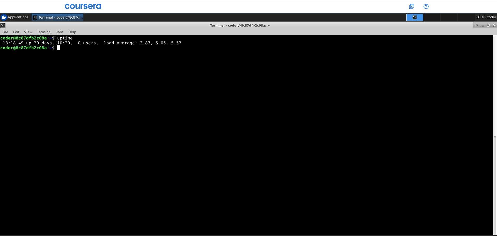
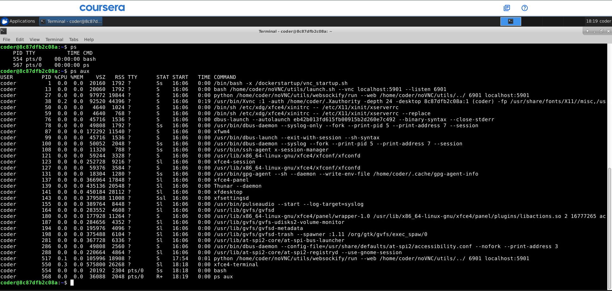
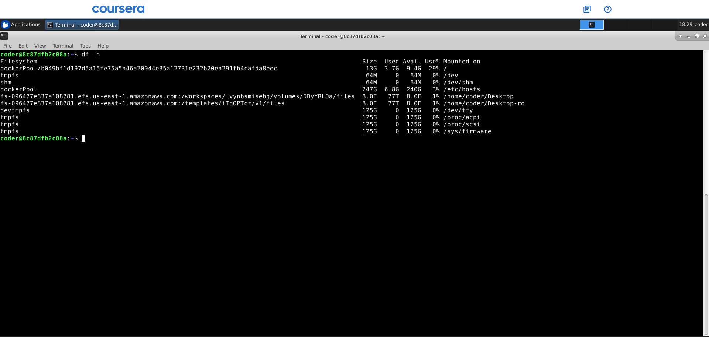
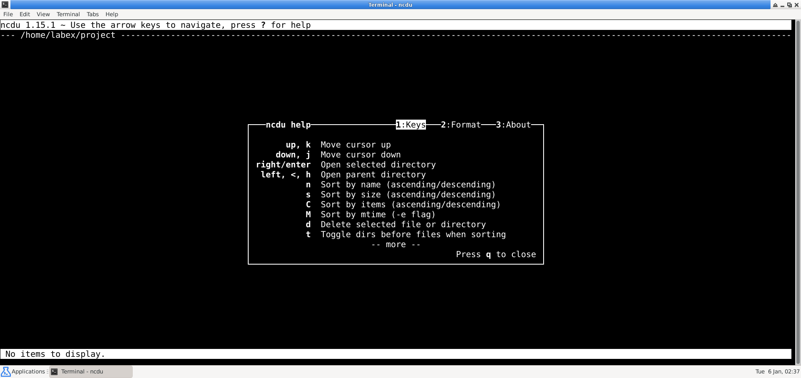

# Command Line Interface and Systems SGA 1 - Question 4: System Monitoring and Process Management

---

## Overview
You must perform all operations without making any configuration changes to the system. These tasks should be executed within your own user account. Since uptime, processes, memory usage, disk usage, and background jobs vary across systems and users, each student's output will be unique.

---

## Task 1: System Uptime Verification

### Question
Display the time elapsed since the system was last booted.

### Screenshot



### Commands Used
```bash
top
uptime
```

### Explanation
The `top` command provides a real-time, dynamic view of system processes, displaying system uptime at the very top of its output along with CPU usage, memory usage, and running processes. It shows how long the system has been running since the last boot.

The `uptime` command in Linux systems shows how long the system has been running, the current time, the number of logged-in users, and the system's load average (average processes waiting for CPU) over the last 1, 5, and 15 minutes.

---

## Task 2: Running Process Listing

### Question
Display a list of all running processes on the system.

### Screenshot



### Commands Used
```bash
ps
ps aux
```

### Explanation
The `ps` command is used to display only a basic snapshot of processes running in the current shell session.

To list a comprehensive, user-oriented list of all running processes on the system, including background daemons, I used `ps aux`, which provides details like the Process ID (PID), CPU usage, and the user associated with the process.

---

## Task 3: CPU Usage Analysis

### Question
Identify the process that is consuming the highest CPU usage among your running processes.

### Screenshot


### Command Used
```bash
top
```

### Explanation
To identify the process consuming the highest CPU, I used the `top` command. This tool provides a real-time, dynamic view of the system, automatically sorting processes by their resource consumption, including CPU and memory usage.

The output is a continuously updating list. The process at the very top of the list under the `COMMAND` column is consuming the most CPU resources at that moment. In this screenshot, it can be seen that the `vnc startup.sh` command was consuming the highest CPU usage.

---

## Task 4: Background Process Execution

### Question
Start a command in the background and verify that it is running.

### Screenshot


### Commands Used
```bash
sleep 100 &
ps
ps aux | grep sleep
```

### Explanation
In Linux, background processing allows a task to run independently of the active terminal. To execute a command in the background, append an ampersand (`&`) to the end of the command (e.g., `sleep 100 &`). I verified it is running by using the `ps` command.

I also used the `ps aux` command with the help of `grep` to pinpoint the exact process running, as `ps aux` would usually give a long list of processes. So, using `grep` to specify which command we want to check is a time-efficient way.

---

## Task 5: Process Priority Management

### Question
Change the priority (niceness) of one of your running processes and display the updated priority.

### Screenshot


### Commands Used
```bash
ps
renice 5 -p 554
ps -l -p 554
```

### Explanation
To change a running process's priority (niceness), I used the `renice` command with the new value and Process ID (PID), and then verified it with `ps -l`.

I first used the `ps` command to check and select which process's priority I want to change. I chose the `bash` command, of which the PID is `554`. I changed its priority to `5` from `0` (lowered its priority). If I want to make the priority higher, it would require the `sudo` command, which is not working in the Coursera labs. Using the `ps -l -p 554` command, I was able to verify that the priority has been successfully changed.

---

## Task 6: Memory Usage Monitoring

### Question
Display memory usage information in a human-readable format.

### Screenshot


### Command Used
```bash
free -h
```

### Explanation
I used the `free` command with the `-h` option to turn it into a human-readable format.

| Field | Description |
|-------|-------------|
| **Total** | Represents the total RAM of the system |
| **Used** | Represents the memory that is currently in use |
| **Free** | Represents free memory |
| **Shared** | Represents shared memory among processes |
| **Available** | Represents the estimated amount of memory available |

---

## Task 7: Disk Space Inspection

### Question
Display the disk space usage of the filesystem where your home directory resides.

### Screenshot


### Command Used
```bash
df -h
```

### Explanation
To check the filesystem where the home directory resides, I used the `df -h` command. The `df` (disk free) command displays used and available space on all mounted filesystems, and the `-h` option ensures the output is in a human-readable format.

---

## Task 8: Shell Identification

### Question
Display the name of the shell currently in use.

### Screenshot


### Command Used
```bash
echo $0
```

### Explanation
The command `echo $0` displays the name of the process currently running, which is typically the shell's name. The shell that I'm currently using is `bash`.

---

## Task 9: Output Redirection

### Question
Redirect the output of a system information command of your choice into a file named `system_report.txt`.

### Screenshot


### Commands Used
```bash
hostname > system_report.txt
ps >> system_report.txt
uptime >> system_report.txt
df -h >> system_report.txt
cat system_report.txt
```

### Explanation
I added all the system information from the commands `hostname`, `ps`, `uptime`, and `df -h` into the `system_report.txt` file and used the `cat` command to check if they all have been successfully included in the file.

The redirection of the first output only used one output redirection operator (`>`) as it was adding to an empty file, but if I had used only one (`>`) for the next commands, then it would have over-written the file input and would've given only the latest addition. Therefore, I used the double output redirection operator (`>>`) to append to the next lines and not over-write the existing info.

---

## Task 10: Disk Usage Visualization

### Question
Demonstrate the usage of the `ncdu` tool using appropriate options and briefly explain what it shows.

### Screenshot



### Command Used
```bash
ncdu
```

### Explanation
`ncdu` (NCurses Disk Usage) is an interactive, visual version of `du`. It provides an easy-to-navigate interface to see which folders are taking up the most space.

> **Note:** `ncdu` was not installed or available in the Coursera labs system, and due to not having permission to use `sudo` in the Coursera labs, I am using my personal OS installation to demonstrate the command.

I had to first install the `ncdu` tool before running it. Once the tool was installed, I was able to run it and navigate through the disk usage visualization.

---
